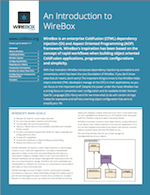

# Introduction

LogBox is an enterprise ColdFusion logging library designed to give you flexibility, simplicity and power when logging or tracing is needed in your applications. LogBox is part of the ColdBox Platform 3.0 suite of services and libraries and allows you to easily build upon it's logging framework in order to meet any logging or reporting needs your applications has. LogBox surpasses ColdFusion's very basic cflog tag. LogBox allows you to create multiple destinations for your loggings and even configure destinations or change them at runtime.

Almost every application needs logging and/or tracing capabilities and we have developed LogBox to satisfy these needs. Although you should take care not to over-use logging as it can slow down an application, LogBox offers you the capabilities to filter out or cancel logging noise a-la-carte. LogBox was inspired by the original logging capabilities in ColdBox and in the [Log4j](http://logging.apache.org/log4j/2.x/) project.

<h2 style="color:grey">LogBox RefCard</h2>

<h2 style="color:grey">Some Resources</h2>

* [LogBox Release Notes](http://logging.apache.org/log4j/)
* [http://logging.apache.org/log4j/](http://logging.apache.org/log4j/2.x/)

