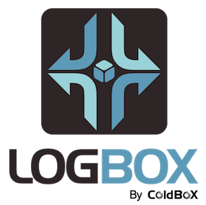

# Introduction

```
 __        ______     _______ .______     ______   ___   ___ 
|  |      /  __  \   /  _____||   _  \   /  __  \  \  \ /  / 
|  |     |  |  |  | |  |  __  |  |_)  | |  |  |  |  \  V  /  
|  |     |  |  |  | |  | |_ | |   _  <  |  |  |  |   >   <   
|  `----.|  `--'  | |  |__| | |  |_)  | |  `--'  |  /  .  \  
|_______| \______/   \______| |______/   \______/  /__/ \__\
```

## LogBox Manual - Version 8.x



LogBox is a **BoxLang** and CFML logging library designed to give you flexibility, simplicity, and power when logging or tracing is needed in your applications. LogBox is also part of the ColdBox Platform suite of services and libraries. It allows you to easily build upon its logging framework to meet any logging or reporting needs your applications have. LogBox surpasses ColdFusion's very basic `cflog` tag. LogBox allows you to create multiple destinations for your loggings and even configure multiple destinations or change them at runtime.

Almost every application needs logging and/or tracing capabilities, and we have developed LogBox to satisfy these needs. Although you should not over-use logging as it can slow down an application, LogBox allows you to filter out or cancel logging noise.


**LogBox is a standalone framework for BoxLang and CFML applications, and it is also bundled with the ColdBox Platform.**


### Explore LogBox

<table data-view="cards" data-full-width="false"><thead><tr><th></th><th></th><th data-hidden data-card-target data-type="content-ref"></th></tr></thead><tbody><tr><td>📝 <strong>Flexible Logging API</strong></td><td>Debug, info, warn, error, and fatal severities with lazy closure-based messages</td><td><a href="usage/using-a-logger-object/README.md">README.md</a></td></tr><tr><td>📤 <strong>Multiple Appenders</strong></td><td>Console, file, rolling file, database, email, socket, and async-wrapped appenders</td><td><a href="getting-started/how-does-logbox-work/appender.md">appender.md</a></td></tr><tr><td>🗂️ <strong>Category-Based Configuration</strong></td><td>Route different parts of your app to different destinations, down to the class level</td><td><a href="configuration/configuring-logbox/README.md">README.md</a></td></tr><tr><td>🧱 <strong>Custom Appenders &#x26; Layouts</strong></td><td>Extend <code>AbstractAppender</code> or implement your own layout formatting</td><td><a href="extending-logbox/README.md">README.md</a></td></tr></tbody></table>

## Versioning

LogBox is maintained under the [Semantic Versioning](https://semver.org) guidelines as much as possible. Releases will be numbered in the following format:

```
<major>.<minor>.<patch>
```

And constructed with the following guidelines:

* Breaking backward compatibility bumps the major (and resets the minor and patch)
* New additions without breaking backward compatibility bumps the minor (and resets the patch)
* Bug fixes and misc changes bump the patch

## License

The ColdBox Platform, LogBox, is open source and licensed under the [Apache 2](https://www.apache.org/licenses/LICENSE-2.0.html) License.

* Copyright by Ortus Solutions, Corp
* ColdBox, CacheBox, Wirebox, and LogBox are registered trademarks of Ortus Solutions, Corp.

## Discussion & Help

The LogBox help and discussion group can be found here: [https://groups.google.com/forum/#!forum/coldbox](https://groups.google.com/forum/#!forum/coldbox)

## Reporting a Bug

We all make mistakes from time to time :) So why not let us know about it and help us out? We also love pull requests, so please star us and fork us: [https://github.com/coldbox/coldbox-platform](https://github.com/coldbox/coldbox-platform)

### Jira Issue Tracking

* [https://ortussolutions.atlassian.net/browse/COLDBOX](https://ortussolutions.atlassian.net/browse/COLDBOX)
* [https://ortussolutions.atlassian.net/browse/WIREBOX](https://ortussolutions.atlassian.net/browse/WIREBOX)
* [https://ortussolutions.atlassian.net/browse/LOGBOX](https://ortussolutions.atlassian.net/browse/LOGBOX)
* [https://ortussolutions.atlassian.net/browse/CACHEBOX](https://ortussolutions.atlassian.net/browse/CACHEBOX)

## Professional Open Source


ColdBox is a professional open source software backed by [Ortus Solutions, Corp](http://www.ortussolutions.com/services) offering services like:

* Custom Development
* Professional Support & Mentoring
* Training
* Server Tuning
* Security Hardening
* Code Reviews
* [Much More](http://www.ortussolutions.com/services)

## Resources

* Official Site: [http://www.coldbox.org](https://www.coldbox.org)
* CFCasts Video Training: [http://ww.cfcasts.com](http://ww.cfcasts.com)
* Source Code: [https://github.com/coldbox/coldbox-platform](https://github.com/coldbox/coldbox-platform)
* Bug Tracker: [https://ortussolutions.atlassian.net/browse/LOGBOX](https://ortussolutions.atlassian.net/browse/LOGBOX)
* Twitter: [@coldbox](http://www.twitter.com/coldbox)
* Facebook: [https://www.facebook.com/coldboxplatform](https://www.facebook.com/coldboxplatform)
* YouTube: [https://www.youtube.com/c/ortussolutions](https://www.youtube.com/c/ortussolutions)

### HONOR GOES TO GOD ABOVE ALL

Because of His grace, this project exists. If you don't like this, don't read it; it's not for you.

> "Therefore being justified by \*\*faith\*\*, we have peace with God through our Lord Jesus Christ: By whom also we have access by \*\*faith\*\* into this \*\*grace\*\* wherein we stand, and rejoice in hope of the glory of God." Romans 5:5
