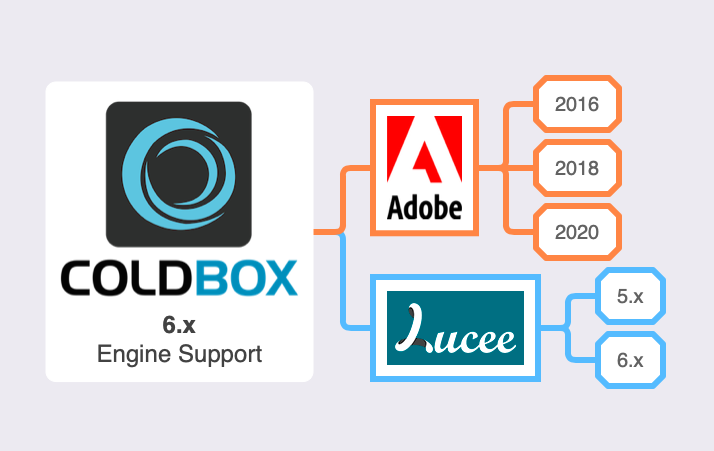

# What's New With 6.0.0

LogBox 6.0.0 is a major release for LogBox. It has some dramatic new features as we keep pushing for more modern and sustainable approaches to web development. We break down the major areas of development below and you can also find the full release notes per library at the end.

## Engine Support


It is also yet another source code reduction due to the dropping of support for the following CFML Engines:

* Adobe ColdFusion 11
* Lucee 4.5

The info-graphic above shows you the supported engines the 6.x platform will support.

## Logging Enhancements

LogBox has been entirely rewritten in script and a more fluent programming approach. It has also been revamped to leverage the scheduling executors and async programming aspects of our async package.  All loggers now sport logging via an async queue and it is completely non-blocking.  If you do heavy logging, the performance will be substantial.



## LogBox Config Path Init

If you are using LogBox in standalone mode, you can now construct it by passing the path to your LogBox configuration file or no path at all and we will construct LogBox with our new default config file to stream logs to the console.

```javascript
application.logbox = new LogBox();

application.logbox = new LogBox( "config.MyLogBox" );
```

## Release Notes



### Bugs

* \[[LOGBOX-35](https://ortussolutions.atlassian.net/browse/LOGBOX-35)\] - FileAppender: if logging happens in a thread, queue never gets processed and, potentially, you run out of heap space
* \[[LOGBOX-38](https://ortussolutions.atlassian.net/browse/LOGBOX-38)\] - Rotate property is defined but never used
* \[[LOGBOX-45](https://ortussolutions.atlassian.net/browse/LOGBOX-45)\] - Work around for adobe bug CF-4204874 where closures are holding on to tak contexts
* \[[LOGBOX-50](https://ortussolutions.atlassian.net/browse/LOGBOX-50)\] - Rolling file appender inserting tabs on first line

### New Features

* \[[LOGBOX-5](https://ortussolutions.atlassian.net/browse/LOGBOX-5)\] - Allow config path as string in LogBox init \(standalone\)
* \[[LOGBOX-11](https://ortussolutions.atlassian.net/browse/LOGBOX-11)\] - Allow standard appenders to be configured by name \(instead of full path\)
* \[[LOGBOX-36](https://ortussolutions.atlassian.net/browse/LOGBOX-36)\] - Added an \`err\(\)\` to abstract appenders for reporting to the error streams
* \[[LOGBOX-42](https://ortussolutions.atlassian.net/browse/LOGBOX-42)\] - All appenders get a reference to the running LogBox instance
* \[[LOGBOX-43](https://ortussolutions.atlassian.net/browse/LOGBOX-43)\] - LogBox has a scheduler executor and the asyncmanager attached to it for standalone and ColdBox mode.
* \[[LOGBOX-44](https://ortussolutions.atlassian.net/browse/LOGBOX-44)\] - Rolling appender now uses the new async schedulers to stream data to files
* \[[LOGBOX-46](https://ortussolutions.atlassian.net/browse/LOGBOX-46)\] - Update ConsoleAppender to use TaskScheduler
* \[[LOGBOX-47](https://ortussolutions.atlassian.net/browse/LOGBOX-47)\] - AbstractAppender log listener and queueing facilities are now available for all appenders
* \[[LOGBOX-48](https://ortussolutions.atlassian.net/browse/LOGBOX-48)\] - DB Appender now uses a queueing approach to sending log messages
* \[[LOGBOX-49](https://ortussolutions.atlassian.net/browse/LOGBOX-49)\] - Rolling File Appender now uses the async scheduler for log rotation checks

### Improvements

* \[[LOGBOX-37](https://ortussolutions.atlassian.net/browse/LOGBOX-37)\] - Improvements to threading for logging to avoid dumb Adobe duplicates
* \[[LOGBOX-41](https://ortussolutions.atlassian.net/browse/LOGBOX-41)\] - refactoring of internal utility closures to udfs to avoid ACF memory leaks: CF-4204874
* \[[LOGBOX-51](https://ortussolutions.atlassian.net/browse/LOGBOX-51)\] - Migrations to script and more fluent programming



